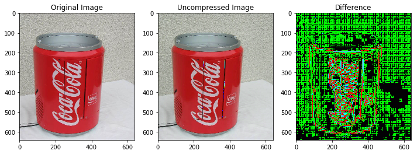
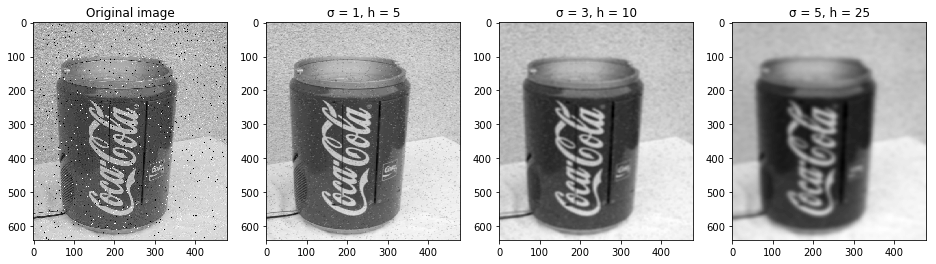

# DSP-Python
A set of signal processing applications written in Python. This repo was created with exercises for the Digital Signal Processing, 2020 class of Saarland University.

### 1. JPEG Compression: 
An implementation of selected steps of JPEG compression

### 2. Gaussian Filter: 
An implementation Gaussian Filter for denosing with convolution

